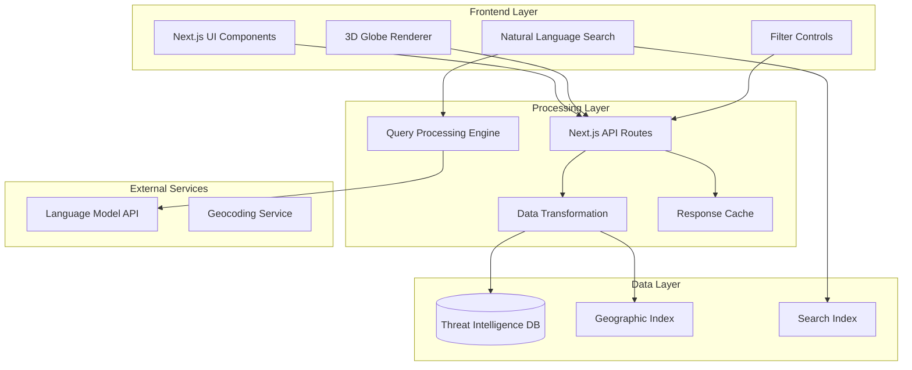

# Design Document

## Overview

The Cyber Threat Globe is a sophisticated 3D web application built with Next.js that visualizes global cybersecurity and financial vulnerability data on an interactive globe. The platform serves as Gen Digital's flagship digital destination for institutional investors, C-suite executives, and security experts, demonstrating comprehensive threat intelligence capabilities through advanced visualization techniques.

The system features a responsive 3D globe with zoom-based visualization transitions, natural language query processing, multi-criteria filtering, and elegant digital filament effects. Data points are rendered as glowing pixels that cluster into heat map patterns at global zoom levels and resolve to individual threats at regional detail levels.

## Architecture

### High-Level Architecture



### Digital Filament Animation Technical Approach

The digital filament effects will be implemented using a multi-layered approach to achieve the flowing, luminous appearance shown in the reference images:

#### Filament Geometry and Animation
- **Spline-based Paths**: Use Three.js CatmullRomCurve3 to create smooth, flowing paths around the globe
- **Dynamic Tessellation**: Adaptive geometry subdivision based on camera distance for performance optimization
- **Parametric Animation**: Time-based parameter animation along spline paths for continuous flow effect

#### Shader Implementation
```glsl
// Vertex shader for filament flow animation
attribute float progress;
attribute float offset;
uniform float time;
uniform float flowSpeed;

void main() {
    // Animate progress along the filament path
    float animatedProgress = mod(progress + time * flowSpeed + offset, 1.0);
    
    // Apply flowing wave distortion
    vec3 position = position + normal * sin(animatedProgress * PI * 2.0) * 0.1;
    
    gl_Position = projectionMatrix * modelViewMatrix * vec4(position, 1.0);
}
```

#### Particle System Integration
- **GPU Particles**: Use Three.js GPUComputationRenderer for thousands of particles
- **Magnetic Field Simulation**: Particles follow invisible magnetic field lines around the globe
- **Lifecycle Management**: Particles spawn, flow along paths, and fade out naturally

#### Post-Processing Pipeline
- **Bloom Effect**: Selective bloom on filament materials for luminous glow
- **Chromatic Aberration**: Subtle color separation for premium visual quality
- **Temporal Anti-Aliasing**: Smooth animation without flickering

### Technology Stack

- **Frontend Framework**: Next.js 14 with App Router for server-side rendering and optimal performance
- **3D Rendering**: Three.js with React Three Fiber for WebGL-based globe visualization
- **Visual Effects**: Custom GLSL shaders for filament effects, Three.js particle systems, and post-processing pipeline for glow/bloom effects
- **3D Utilities**: @react-three/drei for optimized components, @react-three/postprocessing for visual effects pipeline
- **Styling**: Tailwind CSS for responsive design and component styling
- **Database**: PostgreSQL with PostGIS extension for geospatial data storage and queries
- **Search**: Elasticsearch for full-text search and geographic queries
- **Caching**: Redis for API response caching and session management
- **Natural Language Processing**: Integration with OpenAI GPT-4 or similar LLM for query interpretation
- **Deployment**: Vercel for frontend hosting with edge functions

#### Key Dependencies
```json
{
  "@react-three/fiber": "^8.15.0",
  "@react-three/drei": "^9.88.0", 
  "@react-three/postprocessing": "^2.15.0",
  "three": "^0.158.0",
  "leva": "^0.9.35"
}
```

## Components and Interfaces

### Core Components

#### 1. Globe Visualization Engine
- **GlobeRenderer**: Main Three.js component managing 3D globe rendering
- **DataPointManager**: Handles rendering and clustering of threat data points
- **ZoomController**: Manages zoom-based transitions between heat map and pixel views
- **FilamentSystem**: Renders digital filament effects using custom shaders and particle systems
  - **FilamentShader**: Custom GLSL vertex/fragment shaders for flowing light streaks
  - **ParticleEmitter**: GPU-accelerated particle system for ambient particles along filament paths
  - **CursorTrail**: Real-time cursor-following filament effect using spline interpolation
  - **GlowPostProcessor**: Bloom and glow post-processing effects for luminous appearance
- **ColorSchemeManager**: Applies threat (red/orange/yellow) and protection (blue/purple) color coding

#### 2. User Interface Components
- **SearchBar**: Natural language query input with autocomplete suggestions
- **FilterPanel**: Multi-criteria filtering interface (regions, brands, topics, threat types)
- **DataPointDetail**: Modal or sidebar displaying detailed threat information
- **LoadingAnimation**: Digital filament loading sequence during data fetch
- **NavigationControls**: Zoom, rotation, and view reset controls

#### 3. Data Processing Components
- **QueryProcessor**: Interprets natural language queries and extracts geographic/topical intent
- **DataTransformer**: Converts raw threat intelligence into visualization-ready format
- **GeospatialEngine**: Handles coordinate validation, clustering, and geographic queries
- **CacheManager**: Manages API response caching and data freshness

### API Interfaces

#### Data Retrieval Endpoints
```typescript
// Get threat data for geographic bounds
GET /api/threats?bounds={lat1,lng1,lat2,lng2}&zoom={level}

// Process natural language query
POST /api/search
{
  query: string,
  context?: {
    currentView: { lat, lng, zoom },
    activeFilters: FilterSet
  }
}

// Apply filters to dataset
GET /api/threats/filtered?regions={}&brands={}&topics={}&types={}

// Get detailed threat information
GET /api/threats/{id}
```

#### Data Management Endpoints
```typescript
// Ingest new threat data
POST /api/admin/threats
{
  title: string,
  subhead: string,
  description: string,
  coordinates: { lat: number, lng: number },
  threatType: 'vulnerability' | 'scam' | 'protection',
  severity: number,
  expirationDate?: Date,
  metadata: Record<string, any>
}

// Update existing threat data
PUT /api/admin/threats/{id}

// Deprecate outdated threats
DELETE /api/admin/threats/{id}
```

## Data Models

### Core Data Structures

#### ThreatDataPoint
```typescript
interface ThreatDataPoint {
  id: string;
  title: string;
  subhead: string;
  description: string;
  coordinates: {
    latitude: number;
    longitude: number;
  };
  threatType: 'vulnerability' | 'scam' | 'financial_risk' | 'protection';
  severity: number; // 1-10 scale
  region: string;
  brands: string[];
  topics: string[];
  isQuantitative: boolean;
  statisticalData?: {
    value: number;
    unit: string;
    context: string;
  };
  sources: string[];
  createdAt: Date;
  updatedAt: Date;
  expirationDate?: Date;
  isActive: boolean;
}
```

#### Geographic Clustering
```typescript
interface ClusterData {
  id: string;
  centerCoordinates: {
    latitude: number;
    longitude: number;
  };
  threatCount: number;
  averageSeverity: number;
  dominantThreatType: string;
  zoomThreshold: number; // Zoom level where cluster breaks into individual points
  boundingBox: {
    north: number;
    south: number;
    east: number;
    west: number;
  };
}
```

#### Search Query Processing
```typescript
interface ProcessedQuery {
  originalQuery: string;
  extractedIntent: {
    geographic: {
      locations: string[];
      coordinates?: { lat: number; lng: number }[];
      regions: string[];
    };
    topical: {
      threatTypes: string[];
      brands: string[];
      topics: string[];
    };
    temporal: {
      timeframe?: string;
      urgency?: 'immediate' | 'recent' | 'historical';
    };
  };
  suggestedFilters: FilterSet;
  confidence: number;
}
```

### Database Schema

#### Primary Tables
```sql
-- Main threat intelligence table
CREATE TABLE threat_data (
    id UUID PRIMARY KEY DEFAULT gen_random_uuid(),
    title VARCHAR(255) NOT NULL,
    subhead VARCHAR(500),
    description TEXT NOT NULL,
    coordinates POINT NOT NULL, -- PostGIS point type
    threat_type threat_type_enum NOT NULL,
    severity INTEGER CHECK (severity >= 1 AND severity <= 10),
    region VARCHAR(100),
    brands TEXT[], -- Array of brand names
    topics TEXT[], -- Array of topic tags
    is_quantitative BOOLEAN DEFAULT FALSE,
    statistical_data JSONB,
    sources TEXT[],
    created_at TIMESTAMP WITH TIME ZONE DEFAULT NOW(),
    updated_at TIMESTAMP WITH TIME ZONE DEFAULT NOW(),
    expiration_date TIMESTAMP WITH TIME ZONE,
    is_active BOOLEAN DEFAULT TRUE
);

-- Geographic indexing for fast spatial queries
CREATE INDEX idx_threat_data_coordinates ON threat_data USING GIST (coordinates);
CREATE INDEX idx_threat_data_region ON threat_data (region);
CREATE INDEX idx_threat_data_type ON threat_data (threat_type);
CREATE INDEX idx_threat_data_active ON threat_data (is_active) WHERE is_active = TRUE;

-- Full-text search index
CREATE INDEX idx_threat_data_search ON threat_data USING GIN (
    to_tsvector('english', title || ' ' || subhead || ' ' || description)
);
```

## Correctness Properties

*A property is a characteristic or behavior that should hold true across all valid executions of a system-essentially, a formal statement about what the system should do. Properties serve as the bridge between human-readable specifications and machine-verifiable correctness guarantees.*
### Property Reflection

After reviewing all testable properties from the prework analysis, several areas of redundancy have been identified:

**Redundant Properties Identified:**
- Properties 1.4 and 7.5 both test real-time data updates - can be consolidated
- Properties 2.2 and 2.4 both test globe navigation in response to search - can be combined
- Properties 3.2, 3.3, and 3.4 all test filtering behavior - can be consolidated into comprehensive filter property
- Properties 4.3 and 4.4 both test color coding - can be combined into single color scheme property
- Properties 5.1, 5.2, and 5.4 all test data validation - can be consolidated
- Properties 6.1, 6.2, and 6.3 all test data point detail display - can be combined

**Consolidated Properties:**
The following properties provide unique validation value after removing redundancy:

Property 1: Geographic data mapping accuracy
Property 2: Interactive navigation functionality  
Property 3: Natural language query processing
Property 4: Comprehensive filtering system
Property 5: Zoom-based visualization transitions
Property 6: Color scheme consistency
Property 7: Data validation and schema compliance
Property 8: Data point detail display completeness
Property 9: Real-time data synchronization
Property 10: Automated data lifecycle management
Property 11: Loading sequence and transitions

### Correctness Properties

Property 1: Geographic data mapping accuracy
*For any* threat data point with valid coordinates, the visualization should render the data point at the correct geographic location on the globe
**Validates: Requirements 1.2**

Property 2: Interactive navigation functionality
*For any* user interaction (zoom, rotation, pan), the globe interface should respond appropriately and maintain smooth navigation
**Validates: Requirements 1.3**

Property 3: Natural language query processing
*For any* natural language query, the system should extract relevant geographic and topical intent and return contextually appropriate results
**Validates: Requirements 2.1, 2.3**

Property 4: Search result navigation
*For any* processed query with geographic results, the globe should zoom to the relevant region and highlight applicable data points
**Validates: Requirements 2.2, 2.4**

Property 5: Comprehensive filtering system
*For any* combination of filter criteria (regions, brands, topics, threat types), the system should display only data points matching all selected criteria and restore full dataset when filters are cleared
**Validates: Requirements 3.2, 3.3, 3.4**

Property 6: Zoom-based visualization transitions
*For any* zoom level change, the visualization should appropriately transition between heat map patterns (zoomed out) and individual pixels (zoomed in)
**Validates: Requirements 4.1, 4.2**

Property 7: Color scheme consistency
*For any* data point, the visualization should use red/orange/yellow colors for threat data and blue/purple colors for protection data
**Validates: Requirements 4.3, 4.4**

Property 8: Digital filament effects
*For any* protection data display, the system should render appropriate digital filament effects and cursor-trailing graphics
**Validates: Requirements 4.5**

Property 9: Data validation and schema compliance
*For any* data input, the system should validate required fields (title, subhead, description, coordinates) and reject invalid geographic coordinates
**Validates: Requirements 5.1, 5.2, 5.4**

Property 10: Data point detail display completeness
*For any* selected data point, the system should display all available information including title, subhead, description, and properly formatted statistical data
**Validates: Requirements 6.1, 6.2, 6.3**

Property 11: Overlapping data point navigation
*For any* geographic area with multiple nearby data points, the system should provide clear selection and navigation between overlapping threats
**Validates: Requirements 6.4**

Property 12: UI state preservation
*For any* data point detail view, the system should maintain the user's current geographic focus and zoom level
**Validates: Requirements 6.5**

Property 13: Real-time data synchronization
*For any* database update (new data, modifications, deletions), the globe interface should reflect changes without requiring user refresh
**Validates: Requirements 1.4, 7.5**

Property 14: Automated data lifecycle management
*For any* data point with expiration criteria, the system should automatically remove outdated threat information and integrate new data without manual intervention
**Validates: Requirements 1.5, 7.1, 7.2**

Property 15: Data conflict resolution
*For any* conflicting data entries, the system should apply consistent precedence rules to maintain data integrity
**Validates: Requirements 7.3**

Property 16: Loading sequence transitions
*For any* loading state, the system should display digital filament animation initially, maintain it during data loading, and gracefully transition to interactive visualization when user begins interaction or loading completes
**Validates: Requirements 10.1, 10.2, 10.3, 10.4, 10.5**

## Error Handling

### Client-Side Error Handling

#### 3D Rendering Errors
- **WebGL Compatibility**: Detect WebGL support and provide fallback 2D visualization for unsupported browsers
- **Performance Degradation**: Monitor frame rates and automatically reduce visual complexity for low-performance devices
- **Memory Management**: Implement data point culling and level-of-detail rendering to prevent memory overflow

#### Network and API Errors
- **Connection Failures**: Implement exponential backoff retry logic for failed API requests
- **Partial Data Loading**: Display available data while continuing to load remaining data points
- **Search Service Unavailable**: Provide cached search suggestions and graceful degradation when NLP service is unavailable

#### User Input Validation
- **Invalid Coordinates**: Validate geographic coordinates and provide user feedback for invalid locations
- **Malformed Queries**: Handle natural language queries that cannot be processed and suggest alternative phrasings
- **Filter Conflicts**: Detect impossible filter combinations and guide users toward valid selections

### Server-Side Error Handling

#### Database Errors
- **Connection Pool Exhaustion**: Implement connection pooling with proper timeout and retry mechanisms
- **Query Timeouts**: Set appropriate timeouts for complex geospatial queries and provide partial results when possible
- **Data Integrity Violations**: Validate data schema compliance before database insertion and log validation failures

#### External Service Integration
- **LLM API Failures**: Implement fallback to cached query patterns when natural language processing service is unavailable
- **Geocoding Service Errors**: Maintain local geocoding cache and provide approximate coordinates when external service fails
- **Rate Limiting**: Implement request queuing and throttling to handle API rate limits gracefully

#### Data Processing Errors
- **Invalid Data Formats**: Validate incoming threat intelligence data and quarantine malformed entries for manual review
- **Coordinate Validation**: Verify geographic coordinates are within valid ranges and flag suspicious locations
- **Duplicate Detection**: Implement deduplication logic to prevent duplicate threat entries from corrupting visualizations

## Testing Strategy

### Dual Testing Approach

The testing strategy employs both unit testing and property-based testing to ensure comprehensive coverage:

- **Unit tests** verify specific examples, edge cases, and error conditions
- **Property tests** verify universal properties that should hold across all inputs
- Together they provide comprehensive coverage: unit tests catch concrete bugs, property tests verify general correctness

### Unit Testing Requirements

Unit tests will cover:
- Specific examples that demonstrate correct behavior
- Integration points between components
- Error conditions and edge cases
- UI component rendering and interaction

The unit testing approach focuses on concrete scenarios while avoiding excessive test volume, as property-based tests handle broad input coverage.

### Property-Based Testing Requirements

**Framework Selection**: fast-check for JavaScript/TypeScript property-based testing
**Test Configuration**: Each property-based test will run a minimum of 100 iterations to ensure thorough random input coverage
**Test Tagging**: Each property-based test will include a comment explicitly referencing the correctness property from this design document using the format: '**Feature: cyber-threat-globe, Property {number}: {property_text}**'
**Implementation Mapping**: Each correctness property will be implemented by a single property-based test

Property-based tests will focus on:
- Geographic coordinate validation and mapping accuracy
- Filter combination logic across all possible criteria
- Natural language query processing with diverse inputs
- Zoom-based visualization transitions at various levels
- Data validation with randomly generated threat intelligence
- Real-time synchronization with simulated database updates

### Integration Testing

Integration tests will verify:
- End-to-end user workflows from query to visualization
- Database integration with PostGIS geospatial queries
- External API integration (LLM, geocoding services)
- Performance under realistic data loads
- Cross-browser compatibility for 3D rendering

### Performance Testing

Performance validation will include:
- Rendering performance with large datasets (10,000+ data points)
- Memory usage monitoring during extended sessions
- Network request optimization and caching effectiveness
- Mobile device performance and battery impact
- Load testing for concurrent user scenarios

The testing strategy ensures both functional correctness through property verification and practical usability through comprehensive integration and performance validation.