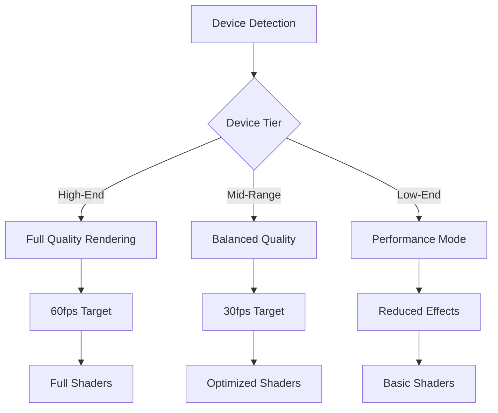

# Design Document

## Overview

This design transforms the cyber threat globe visualization app from a desktop-focused experience into a fully responsive application that delivers optimal user experience across all device types. The design employs a mobile-first approach with progressive enhancement, ensuring the core functionality works seamlessly on mobile devices while taking advantage of larger screens when available.

The solution addresses the unique challenges of mobile 3D visualization: limited screen real estate, touch-based interaction, performance constraints, and varying network conditions. By implementing adaptive layouts, optimized rendering, and intuitive touch controls, users will be able to explore global cyber threat data effectively regardless of their device.

## Architecture

### Responsive Design System

The architecture follows a three-tier responsive approach:

1. **Mobile-First Foundation (320px-767px)**
   - Single-column layouts with full-width components
   - Touch-optimized controls with minimum 44px touch targets
   - Simplified navigation with collapsible panels
   - Reduced visual complexity to focus on core functionality

2. **Tablet Adaptation (768px-1023px)**
   - Hybrid layouts combining mobile patterns with desktop features
   - Side-by-side panels where screen space permits
   - Enhanced touch controls with gesture recognition
   - Optimized for both portrait and landscape orientations

3. **Desktop Enhancement (1024px+)**
   - Multi-column layouts with persistent UI panels
   - Mouse and keyboard optimizations
   - Advanced features and detailed information displays
   - Full feature set with maximum visual fidelity

### Performance Architecture

The performance system adapts rendering quality based on device capabilities:



## Components and Interfaces

### Responsive Layout Manager

**Purpose**: Orchestrates layout changes across breakpoints and manages component visibility.

**Key Methods**:
- `detectViewport()`: Determines current viewport category
- `updateLayout(viewport)`: Applies appropriate layout configuration
- `handleOrientationChange()`: Manages device rotation transitions
- `optimizeForDevice()`: Adjusts performance settings based on device capabilities

**Responsive Breakpoints**:
```typescript
const breakpoints = {
  mobile: { min: 320, max: 767 },
  tablet: { min: 768, max: 1023 },
  desktop: { min: 1024, max: Infinity }
}
```

### Mobile Navigation System

**Purpose**: Provides touch-friendly navigation patterns optimized for small screens.

**Components**:
- **Hamburger Menu**: Collapsible navigation for secondary features
- **Tab Bar**: Bottom navigation for primary functions
- **Floating Action Button**: Quick access to search functionality
- **Gesture Handler**: Manages swipe, pinch, and tap interactions

### Adaptive Globe Renderer

**Purpose**: Optimizes Three.js rendering for mobile devices while maintaining visual quality.

**Key Features**:
- Dynamic pixel ratio adjustment (capped at 1.5 for performance)
- Adaptive level-of-detail (LOD) based on device capabilities
- Progressive loading of 3D assets
- Touch-optimized camera controls

**Performance Tiers**:
```typescript
interface PerformanceTier {
  pixelRatio: number;
  shadowQuality: 'high' | 'medium' | 'low' | 'disabled';
  particleCount: number;
  antialiasing: boolean;
  postProcessing: boolean;
}
```

### Touch Control System

**Purpose**: Translates touch gestures into 3D navigation commands.

**Gesture Mappings**:
- Single finger drag → Globe rotation
- Pinch/spread → Zoom in/out
- Double tap → Focus on region
- Long press → Context menu
- Two-finger tap → Reset view

### Mobile UI Components

#### Responsive Search Bar
- Expands to full width on mobile
- Voice search integration when available
- Keyboard-aware positioning to avoid obstruction
- Swipe-to-dismiss suggestions

#### Adaptive Filter Panel
- Full-screen modal on mobile
- Collapsible sections with touch-friendly controls
- Quick filter chips for common selections
- Clear visual hierarchy with larger touch targets

#### Mobile Threat Detail Panel
- Full-screen modal presentation
- Swipe gestures for navigation
- Optimized content layout for reading
- Share functionality integration

## Data Models

### Device Capability Model

```typescript
interface DeviceCapabilities {
  tier: 'high' | 'medium' | 'low';
  maxPixelRatio: number;
  supportsWebGL2: boolean;
  maxTextureSize: number;
  estimatedMemory: number;
  touchSupport: boolean;
  orientationSupport: boolean;
  networkSpeed: 'fast' | 'medium' | 'slow';
}
```

### Responsive Configuration Model

```typescript
interface ResponsiveConfig {
  viewport: 'mobile' | 'tablet' | 'desktop';
  orientation: 'portrait' | 'landscape';
  deviceCapabilities: DeviceCapabilities;
  performanceSettings: PerformanceTier;
  layoutSettings: {
    showSidebar: boolean;
    useFullScreenModals: boolean;
    enableGestures: boolean;
    touchTargetSize: number;
  };
}
```

### Touch Interaction Model

```typescript
interface TouchInteraction {
  type: 'tap' | 'drag' | 'pinch' | 'longpress' | 'doubletap';
  startPosition: { x: number; y: number };
  currentPosition: { x: number; y: number };
  scale?: number;
  duration: number;
  target: HTMLElement;
}
```

## Correctness Properties

*A property is a characteristic or behavior that should hold true across all valid executions of a system-essentially, a formal statement about what the system should do. Properties serve as the bridge between human-readable specifications and machine-verifiable correctness guarantees.*

Now I'll analyze the acceptance criteria to determine which can be tested as properties:

<function_calls>
<invoke name="prework">
<parameter name="featureName">mobile-responsive-design

### Property Reflection

After reviewing all properties identified in the prework analysis, I've identified several areas where properties can be consolidated to eliminate redundancy:

**Layout Properties**: Properties 1.1 and 1.2 both test layout adaptation but for different viewport sizes. These remain separate as they test distinct behaviors.

**Touch Interaction Properties**: Properties 2.1-2.5 each test different gesture types and remain separate as each provides unique validation.

**UI Panel Properties**: Properties 4.1, 5.1 both test modal behavior but for different panels (filters vs details). These can be combined into a single comprehensive property about modal behavior on mobile.

**Performance Properties**: Properties 6.1, 6.3, 6.4 all test performance adaptation based on different constraints. These can be combined into a single property about performance scaling.

**Accessibility Properties**: Properties 8.1-8.5 each test different accessibility aspects and should remain separate for comprehensive coverage.

Based on this analysis, I'll consolidate redundant properties while maintaining comprehensive test coverage.

## Correctness Properties

Property 1: Mobile layout stack organization
*For any* mobile viewport size (320px-767px), the responsive layout should organize all UI elements into a single-column stack layout with full-width components
**Validates: Requirements 1.1**

Property 2: Tablet hybrid layout adaptation  
*For any* tablet viewport size (768px-1023px), the responsive layout should provide a hybrid layout that combines mobile and desktop patterns appropriately
**Validates: Requirements 1.2**

Property 3: Orientation change responsiveness
*For any* device orientation change event, the responsive layout should complete its adaptation within 300ms
**Validates: Requirements 1.3**

Property 4: Mobile content accessibility
*For any* UI panel displayed on mobile viewport, all content should remain accessible without being cut off or requiring horizontal scrolling
**Validates: Requirements 1.4**

Property 5: Touch drag globe rotation
*For any* single-finger drag gesture on the globe renderer, the globe should rotate smoothly in the direction of the drag
**Validates: Requirements 2.1**

Property 6: Pinch zoom proportionality
*For any* pinch gesture on the globe renderer, the zoom level should change proportionally to the pinch scale factor
**Validates: Requirements 2.2**

Property 7: Double-tap region focus
*For any* double-tap gesture on the globe renderer, the view should zoom to fit the tapped region
**Validates: Requirements 2.3**

Property 8: Data point tap interaction
*For any* tap on a threat data point, the threat details should display without interfering with subsequent globe navigation
**Validates: Requirements 2.4**

Property 9: Touch event conflict prevention
*For any* touch interaction on the globe renderer, browser default scroll and zoom behaviors should be prevented
**Validates: Requirements 2.5**

Property 10: Mobile search bar expansion
*For any* mobile viewport, the search bar should expand to full width with touch targets of at least 44px
**Validates: Requirements 3.1**

Property 11: Mobile suggestion overlay
*For any* search suggestion display on mobile, the suggestions should appear in a full-screen overlay
**Validates: Requirements 3.2**

Property 12: Keyboard obstruction prevention
*For any* virtual keyboard appearance during search, the search results should remain visible and accessible
**Validates: Requirements 3.3**

Property 13: Mobile search result formatting
*For any* search results displayed on mobile, they should be presented in a scrollable list format
**Validates: Requirements 3.4**

Property 14: Voice search availability
*For any* device that supports voice input APIs, the voice search capability should be available and functional
**Validates: Requirements 3.5**

Property 15: Mobile modal behavior
*For any* UI panel (filter or detail) opened on mobile viewport, it should display as a full-screen modal overlay
**Validates: Requirements 4.1, 5.1**

Property 16: Filter summary display
*For any* applied filters on mobile, a clear summary of active filters should be visible
**Validates: Requirements 4.2**

Property 17: Filter clearing accessibility
*For any* opened filter panel on mobile, a clear all filters option should be easily accessible
**Validates: Requirements 4.3**

Property 18: Modal scrolling functionality
*For any* modal with content exceeding viewport height, scrolling should function properly within the modal
**Validates: Requirements 4.4**

Property 19: Mobile touch target sizing
*For any* interactive element on mobile, touch targets should be at least 44px with appropriate spacing
**Validates: Requirements 4.5**

Property 20: Mobile content single-column layout
*For any* threat details displayed on mobile, the content should be formatted in a single-column layout
**Validates: Requirements 5.2**

Property 21: Overlapping threat selection interface
*For any* location with multiple overlapping threats, a mobile-optimized selection interface should be displayed
**Validates: Requirements 5.3**

Property 22: Threat navigation functionality
*For any* threat detail view with related threats, navigation elements should be present and functional
**Validates: Requirements 5.4**

Property 23: Swipe gesture functionality
*For any* detail panel, swipe gestures should enable closing and navigating between threats
**Validates: Requirements 5.5**

Property 24: Performance scaling adaptation
*For any* device with limited capabilities (memory, GPU, or low-end tier), the performance system should automatically reduce rendering complexity, optimize quality, and disable non-essential effects
**Validates: Requirements 6.1, 6.3, 6.4**

Property 25: Progressive loading on slow networks
*For any* slow network connection, the system should implement progressive loading of threat data
**Validates: Requirements 6.2**

Property 26: Mobile hamburger menu presence
*For any* mobile viewport, a hamburger menu should be available for secondary navigation
**Validates: Requirements 7.1**

Property 27: Multi-panel tab interface
*For any* scenario requiring multiple UI panels, a tab-based interface should be implemented
**Validates: Requirements 7.2**

Property 28: Mobile loading indicators
*For any* loading state on mobile, mobile-appropriate loading indicators should be displayed
**Validates: Requirements 7.4**

Property 29: Pull-to-refresh functionality
*For any* mobile interface, pull-to-refresh gestures should trigger threat data updates
**Validates: Requirements 7.5**

Property 30: Screen reader compatibility
*For any* threat data or globe interaction element, meaningful ARIA descriptions should be provided for screen readers
**Validates: Requirements 8.1**

Property 31: Accessibility touch targets and alternatives
*For any* interactive element, touch targets should meet accessibility standards and alternative input methods should be supported
**Validates: Requirements 8.2**

Property 32: Visual accessibility compliance
*For any* visual element, color contrast should meet WCAG standards and text scaling should be supported
**Validates: Requirements 8.3**

Property 33: Voice control support
*For any* navigation action, voice control commands should be supported when available
**Validates: Requirements 8.4**

Property 34: WCAG 2.1 AA compliance
*For any* accessibility audit, the system should pass WCAG 2.1 AA standards for mobile accessibility
**Validates: Requirements 8.5**

## Error Handling

### Network Connectivity Issues
- **Offline Mode**: Cache critical app shell and last viewed threat data for offline browsing
- **Slow Connections**: Implement progressive loading with skeleton screens and data prioritization
- **Connection Loss**: Graceful degradation with retry mechanisms and user feedback
- **Timeout Handling**: Configurable timeouts with exponential backoff for API requests

### Device Capability Limitations
- **Low Memory**: Automatic texture compression and geometry simplification
- **Weak GPU**: Fallback to basic rendering modes with reduced visual effects
- **Old Browsers**: Polyfills for missing APIs and graceful feature degradation
- **Touch Limitations**: Alternative input methods for devices with poor touch sensitivity

### Performance Degradation
- **Frame Rate Drops**: Dynamic quality reduction and effect disabling
- **Thermal Throttling**: Automatic performance scaling based on device temperature
- **Battery Optimization**: Reduced refresh rates and simplified animations in low battery mode
- **Memory Pressure**: Garbage collection optimization and asset cleanup

### User Interface Errors
- **Viewport Changes**: Smooth transitions with layout recalculation
- **Gesture Conflicts**: Priority system for competing touch interactions
- **Modal Stack Issues**: Proper z-index management and focus handling
- **Keyboard Interference**: Dynamic layout adjustment for virtual keyboards

## Testing Strategy

### Dual Testing Approach

This feature requires both unit testing and property-based testing to ensure comprehensive coverage:

**Unit Tests** focus on:
- Specific responsive breakpoint behaviors
- Individual gesture recognition accuracy
- Component rendering in different viewport sizes
- Error handling for specific device limitations
- Integration between touch controls and 3D rendering

**Property-Based Tests** focus on:
- Universal responsive behavior across all viewport sizes
- Touch interaction consistency across all gesture types
- Performance scaling across all device capability ranges
- Accessibility compliance across all interface elements
- Layout adaptation across all orientation changes

### Property-Based Testing Configuration

**Testing Framework**: Fast-check for TypeScript/JavaScript property-based testing
**Test Configuration**: Minimum 100 iterations per property test
**Device Simulation**: Use Puppeteer with device emulation for realistic testing environments

**Property Test Tags**: Each property test must include a comment with the format:
**Feature: mobile-responsive-design, Property {number}: {property_text}**

### Testing Environment Setup

**Real Device Testing**: 
- iOS: iPhone SE, iPhone 14, iPad Air
- Android: Pixel 5a, Samsung Galaxy A-series, OnePlus Nord
- Performance tiers: High-end (flagship), mid-range, budget devices

**Browser Testing**:
- Mobile Safari (iOS 15+)
- Chrome Mobile (Android 10+)
- Samsung Internet
- Firefox Mobile

**Network Simulation**:
- 3G, 4G, and WiFi connection speeds
- Offline scenarios
- High latency conditions

### Performance Testing

**Frame Rate Monitoring**: Continuous FPS tracking during interactions
**Memory Usage**: WebGL memory consumption and garbage collection impact
**Battery Impact**: Power consumption measurement during extended use
**Thermal Behavior**: Performance under thermal throttling conditions

The testing strategy ensures that mobile responsive functionality works reliably across the diverse landscape of mobile devices and usage conditions.